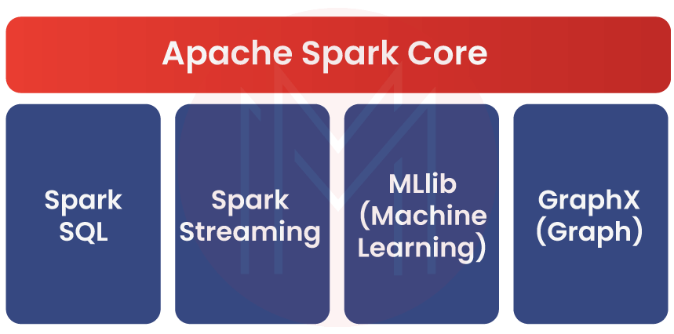
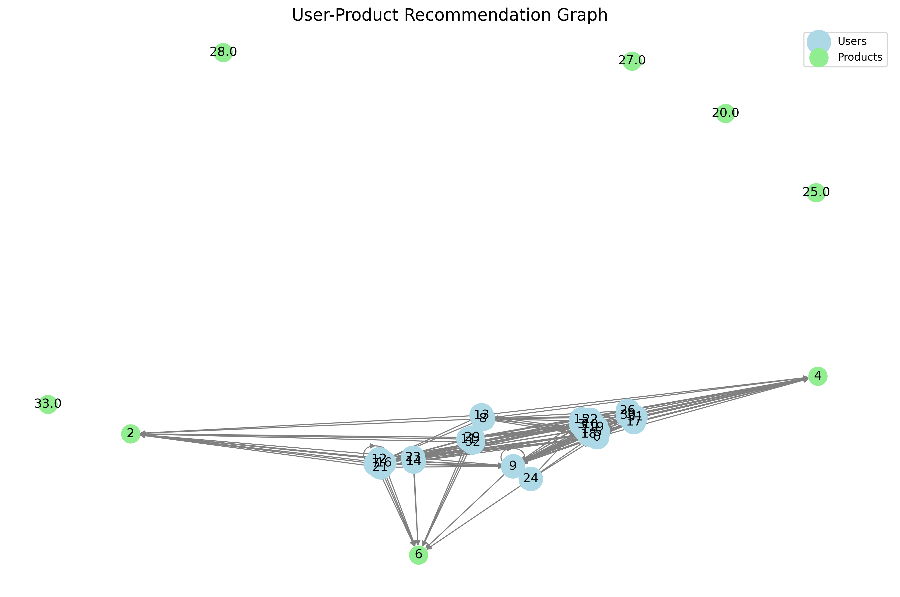
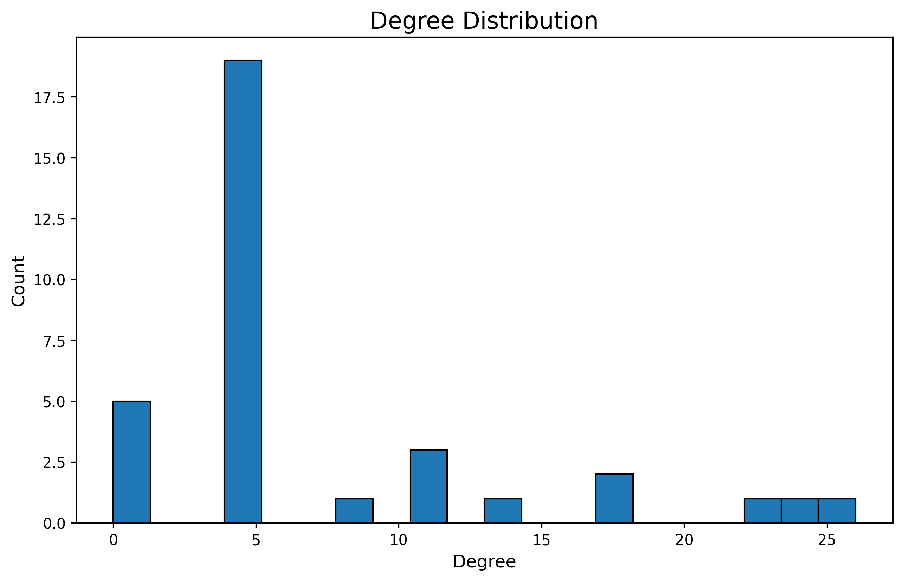
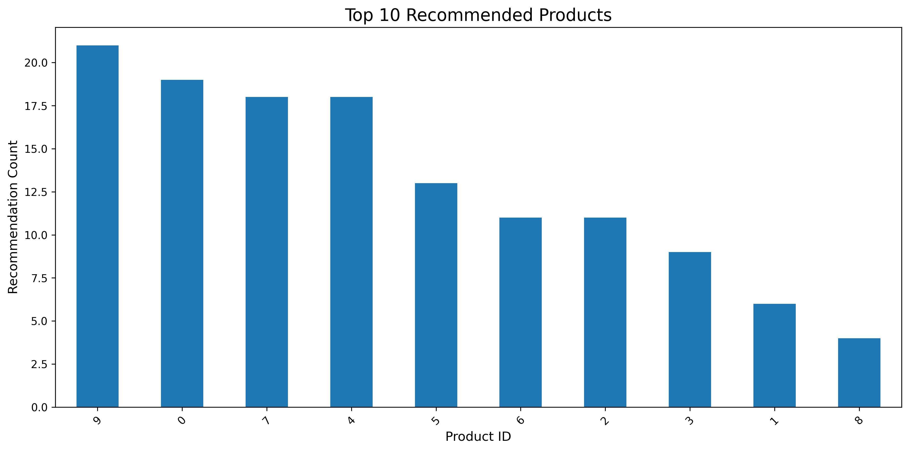

# Product recommendation system

This project is a real-time product recommendation system built using Apache Spark, Kafka, and Python. It processes streaming sales data, generates product recommendations, and provides visualizations for analysis.

## Overview

This project is a real-time product recommendation system that uses Apache Spark for stream processing and machine learning. It processes incoming sales data, builds a recommendation model, and generates product recommendations for users. The system also includes data visualization components to help interpret the results.

## Key Components and Capabilities

- Stream Processing
- Data Accumulation
- Machine Learning Model
- Model Evaluation
- Graph-based Representation
- Data Visualization
- Data Export
- Error Handling and Logging
- Scalability
- Flexibility
- Real-time Updates

## Potential Applications:

- E-commerce platforms for personalized product recommendations.
- Content streaming services for suggesting movies, music, or articles.
- Online advertising for targeted ad placements.
- Retail analytics for understanding customer preferences and product relationships.

## Stack

- Docker
- Python
- Spark (PySpark)
    - Streaming
    - SQL
    - MLlib
    - Graphx
- Kafka
- Zookeeper

## How the Product Recommendation System Works
## 1. 📥 Data Ingestion
The system starts by collecting sales data through Apache Kafka. Each incoming data point includes details like the user ID, product ID, how many units they bought, and the timestamp of the purchase.

## 2. ⚙️ Real-Time Stream Processing
Using Apache Spark Structured Streaming, the data is processed as it arrives. Instead of handling one record at a time, the system waits until enough data is collected (based on a configurable threshold), then processes it in chunks.

## 3. 🧹 Preparing the Data
Once there's enough data, it’s cleaned and prepared for training the model:
User and product IDs are converted into numerical indices.
The system builds a user-product interaction matrix, which is essential for training the recommendation algorithm.

## 4. 🧠 Training the Recommendation Model
To generate recommendations, the system uses ALS (Alternating Least Squares) from Spark MLlib — a popular collaborative filtering algorithm. The dataset is divided into training and testing parts to validate how well the model performs.

## 5. 🎯 Generating Recommendations
After training, the model predicts top N products for each user — essentially guessing what they might want to buy next based on their and others’ behavior.

## 6. 📊 Model Evaluation
To check how good the model is, it uses RMSE (Root Mean Square Error) — a standard metric that tells us how close the predictions are to the actual values in the test set.

## 7. 🔗 Building the Recommendation Graph
Next, the system builds a graph based on the recommendations:
Users and products are nodes.
Edges show which products are recommended to which users.

## 8. 💾 Exporting Data
This graph data (both nodes and edges) is exported into CSV files, making it easy to use in other tools or for visualizations.

## 9. 📈 Visualizing the Results
Finally, the system creates three main visualizations:
A User-Product Recommendation Graph to show how users connect to their suggested products.
A Degree Distribution Plot to analyze the spread of connections in the network.
A Top Products Chart to highlight the most commonly recommended items.

## Visualization

3 visualizations that can provide valuable insights into the recommendation system.

Let's go through each visualization and how to interpret them:

### User-Product Recommendation Graph

This graph shows the relationships between users (lightblue nodes) and products (lightgreen nodes).

**Interpretation:**

- The size and density of connections can indicate how diverse or concentrated the recommendations are.
- Heavily connected products (nodes with many edges) are frequently recommended items.
- Isolated or less connected users might be new users or those with unique preferences.
- Clusters of users connected to similar products might represent user segments with similar tastes.

### Degree Distribution

This histogram shows the distribution of node degrees (number of connections) in the graph.

**Interpretation:**

- The shape of the distribution can tell you about the nature of the recommendation system:
    - A long-tailed distribution (many nodes with few connections, few nodes with many connections) is common in recommendation systems and indicates a presence of "popular" items.
    - Multiple peaks could indicate distinct user or product segments.
- The range of degrees shows how varied the connectivity is in the system.
- Very high degree nodes might be "blockbuster" products or very active users.

### Top 10 Recommended Products 

This bar chart shows the most frequently recommended products.

**Interpretation:**

- These are the "best-seller" or most popular items in terms of recommendations.
- A steep decline in the bar heights might indicate a "long tail" effect where a few products dominate recommendations.

## Future Improvements

- Implement real-time visualization updates.
- Add more advanced recommendation algorithms.
- Integrate with a front-end for interactive user recommendations.
- Incorporate additional data sources for more nuanced recommendations.
